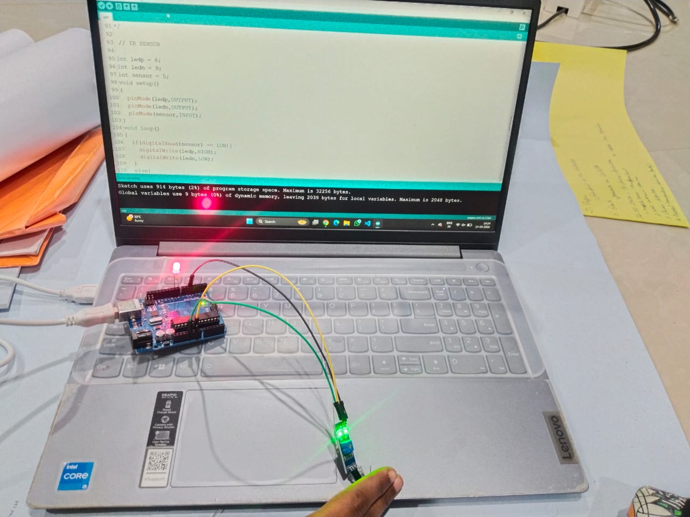
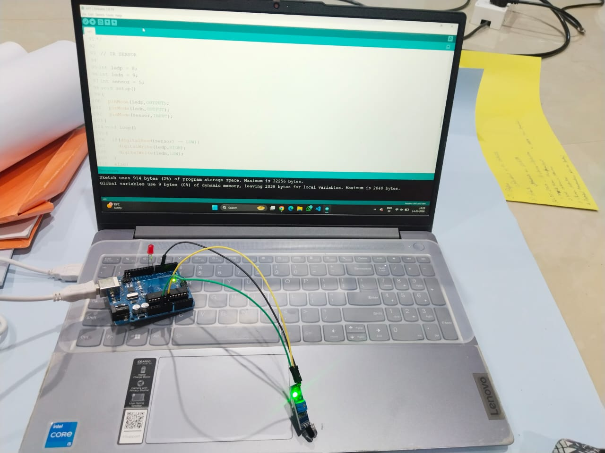

# 📡 IR Sensor LED Control using Arduino

## 📌 Objective
To detect the presence of an object using an **IR sensor** and control an LED based on the detection.

---

## 🔧 Components Used
- Arduino Uno
- IR Sensor
- LED
- Resistor
- Jumper wires
- Breadboard (optional)

---

## ⚙️ Working Principle
An **Infrared (IR) sensor** detects objects by emitting infrared light and measuring the reflected signal.

The Arduino continuously reads the sensor value:

- If an **object is detected** → LED turns **ON**
- If **no object is detected** → LED turns **OFF**

This type of system is commonly used in:

- Obstacle detection systems
- Automatic doors
- Security systems
- Smart automation

---

## 📷 Output Images

### 🚧 Obstacle Detected

### ✅ No Obstacle Detected

---

## 🎥 Demo Video

---

## 🎯 Learning Outcome
- Understanding **IR sensor working principle**
- Reading **digital input from sensors**
- Creating **simple obstacle detection systems**
- Integrating **sensors with Arduino**

---

