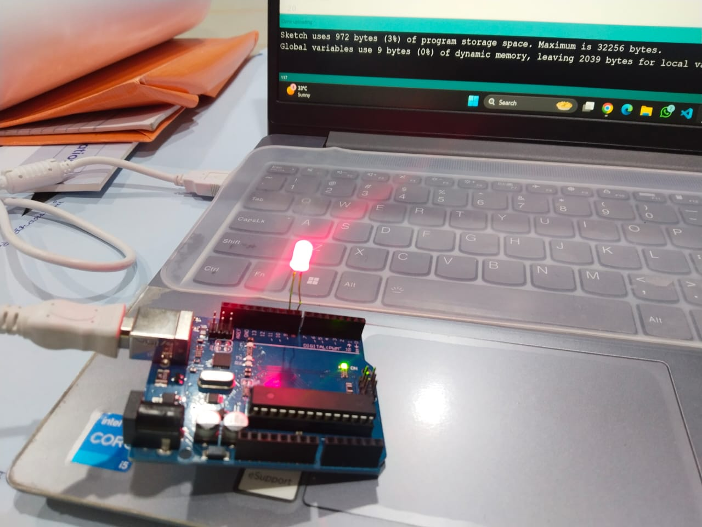
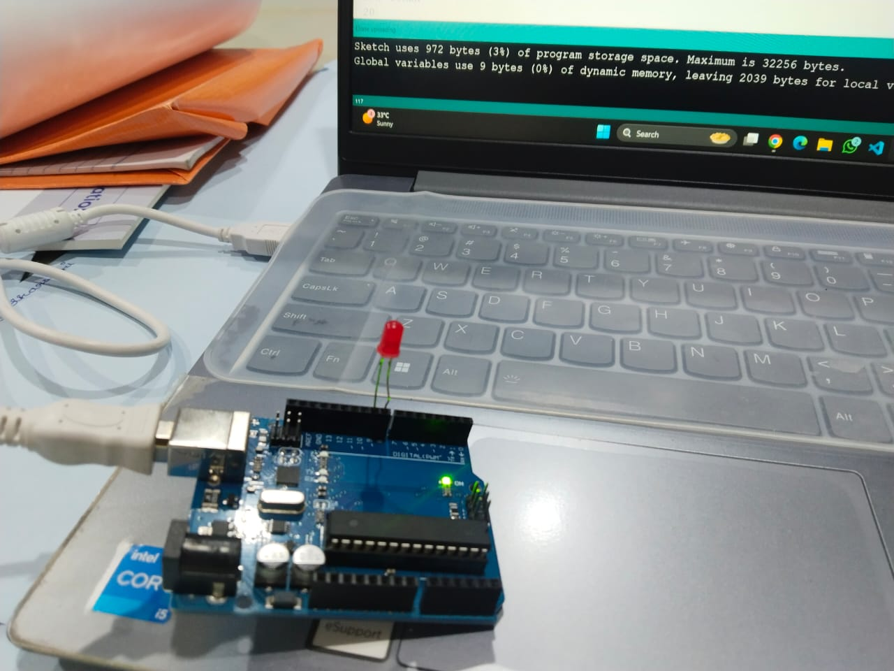

# 💡 LED Blink using Arduino

## 📌 Objective
To create a simple LED blinking program using an **Arduino Uno**, where the LED turns ON and OFF at regular intervals.

---

## 🔧 Components Used
- Arduino Uno
- LED
- Resistor
- Jumper wires

---

## ⚙️ Working Principle
The LED is connected to **digital pin 8** of the Arduino.  
The program turns the LED **ON for 1 second** and then **OFF for 1 second** repeatedly using the `delay()` function.

This demonstrates the basic concept of **digital output control using Arduino**.

---

## 📷 Output

### 🔴 LED ON

### ⚫ LED OFF

---

## 🎯 Learning Outcome
- Understanding **digital output pins**
- Controlling an **LED using Arduino**
- Using the `delay()` function to create timing in embedded systems
