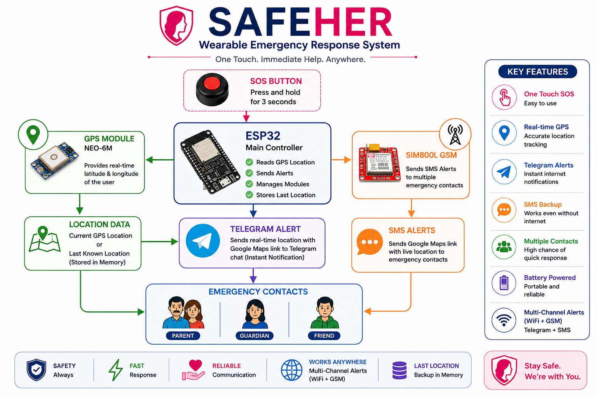
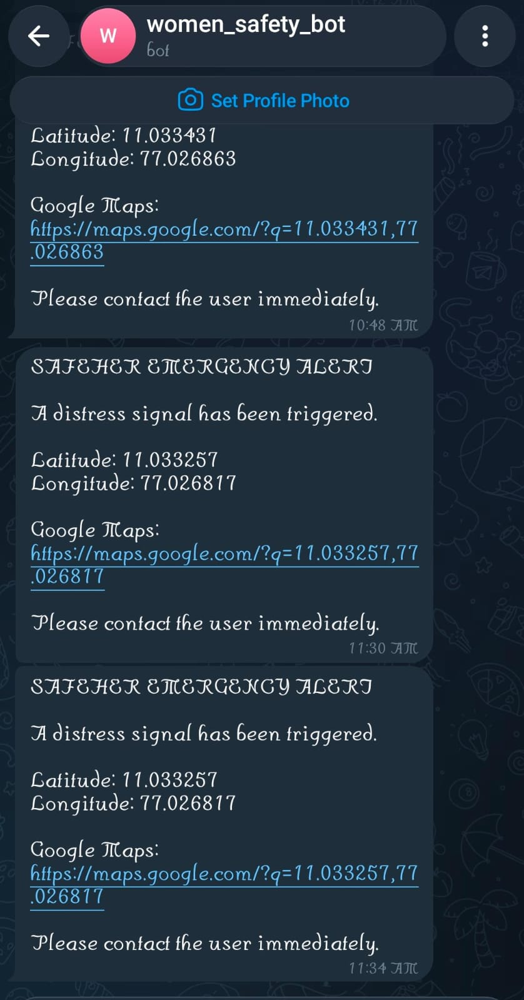
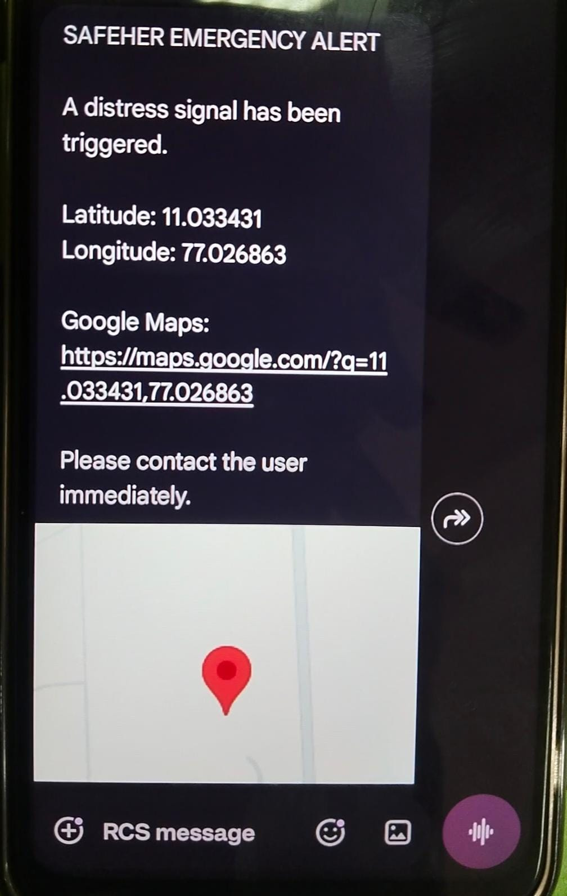
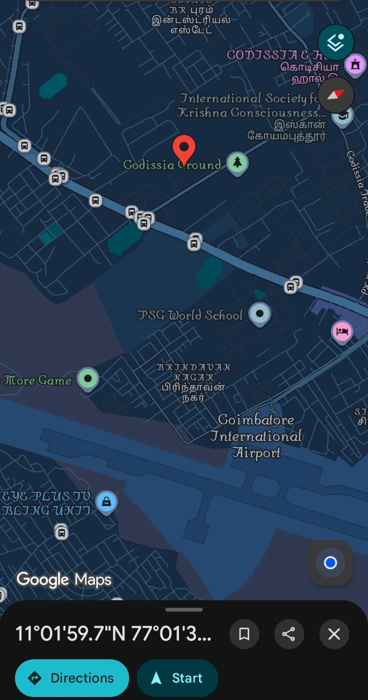

# 🛡️ SafeHer
### An IoT-Based Wearable Emergency Response System

> **One Touch. Instant Help. Anywhere.**


---

## 📌 Overview

**SafeHer** is an IoT-based wearable emergency response system designed to improve personal safety by enabling users to instantly send emergency alerts during distress situations.

With a single press of the SOS button, the device automatically acquires the user's GPS location and sends emergency notifications through **Telegram** and **SMS**, including a Google Maps location link to multiple emergency contacts.

The project demonstrates the practical use of embedded systems, IoT, GPS, and GSM technologies to develop a low-cost, reliabl and portable emergency assistance solution.

---

# ✨ Features

- 🚨 One-touch SOS emergency activation
- ⏱️ 3-second accidental trigger protection
- 📍 Real-time GPS location tracking
- 📱 Telegram emergency notifications
- 📩 GSM SMS backup alerts
- 👨‍👩‍👧 Multiple emergency contacts
- 🗺️ Google Maps location sharing
- 💾 Last known location backup using ESP32 Preferences (NVS)
- 🔋 Rechargeable battery powered operation
- 💰 Low-cost and portable prototype

---

# 🛠 Hardware Components

| Component | Quantity |
|-----------|---------:|
| ESP32 Development Board | 1 |
| NEO-6M GPS Module | 1 |
| SIM800L GSM Module | 1 |
| Push Button (SOS) | 1 |
| 18650 Li-ion Battery | 1 |
| TP4056 Charging Module | 1 |
| Breadboard | 1 |
| Jumper Wires | As Required |

---

# 💻 Software & Libraries

### Development Environment

- Arduino IDE

### Libraries Used

- WiFi.h
- WiFiClientSecure.h
- HTTPClient.h
- TinyGPS++
- Preferences

---

# 🏗 System Architecture

<p align="center">

</p>

---

# ⚙ Working Principle

1. User presses and holds the **SOS Button** for 3 seconds.
2. ESP32 validates the emergency request.
3. GPS module retrieves the current location.
4. If GPS is unavailable, the device uses the last stored emergency location.
5. ESP32 sends:
   - Telegram emergency notification
   - SMS alerts to multiple emergency contacts
6. Emergency contacts receive a Google Maps link for quick navigation.

---

# 📷 Prototype

<p align="center">

</p>

---

# 📱 Screenshots

## Telegram Emergency Alert

<p align="center">

</p>

---

## SMS Alert

<p align="center">

</p>

---

## Google Maps Location

<p align="center">

</p>

---

# 🎥 Demonstration

Project demonstration video:

```
demo/SafeHer_Demo.mp4
```

---

# 📂 Repository Structure

```
safeher-emergency-response-system/
│
├── SafeHer.ino
├── README.md
├── LICENSE
│
├── hardware/
│   └── prototype.jpg
│
├── diagrams/
│   └── block-diagram.png
│
├── screenshots/
│   ├── telegram-alert.png
│   ├── sms-alert.jpg
│   └── google-maps.png
│
└── demo/
    └── safeher-demo.mp4
```

---

# 🚀 Future Scope

### Hardware Improvements

- Custom PCB for compact wearable design
- Miniaturized GPS and GSM modules
- Waterproof enclosure
- Battery level monitoring
- Power optimization

### Software Improvements

- Mobile application for emergency contact management
- Cloud synchronization
- Push notifications
- Over-the-Air (OTA) firmware updates
- Alert history

### Smart Features

- Fall detection
- Indoor positioning using Wi-Fi and cellular networks
- Voice-activated SOS
- Live location tracking
- Vibration feedback
- AI-assisted emergency detection

### Public Safety Integration

- Police notification
- Ambulance integration
- Hospital connectivity
- Geo-fencing
- Safe-zone alerts

---

# 🎯 Applications

- Women's Safety
- Student Safety
- Elderly Assistance
- Child Safety
- Solo Travellers
- Night Shift Employees
- Outdoor Activities

---

# ⚠ Current Limitations

- Prototype uses development boards and breadboard wiring.
- GPS accuracy may reduce indoors.
- Emergency contacts are configured in firmware for the current prototype.
- A custom PCB and mobile app are planned for future versions.

---

# 📜 License

This project is licensed under the **MIT License**.

---

# 👩‍💻 Developed By

**Priyadharshini**

B.E. Computer Science and Engineering

Anna University Regional Campus, Coimbatore

---

⭐ *If you found this project interesting, consider giving it a star!*