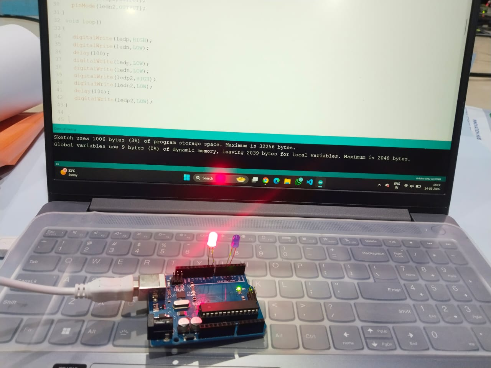

# 🚨 Siren LED using Arduino

## 📌 Objective
To simulate a **siren light effect** by blinking two LEDs alternately using an Arduino.

---

## 🔧 Components Used
- Arduino Uno
- 2 LEDs
- Resistors
- Jumper wires

---

## ⚙️ Working Principle
Two LEDs are connected to the Arduino.  
The program turns **LED 1 ON**, then **LED 2 ON**, repeatedly with a short delay.

This creates a **flashing pattern similar to a siren light** used in emergency vehicles.

---

## 📷 Output Image

---

## 🎥 Output Video

---

## 🎯 Learning Outcome
- Controlling **multiple LEDs using Arduino**
- Creating **alternating LED patterns**
- Understanding **timing control using delay()**

---