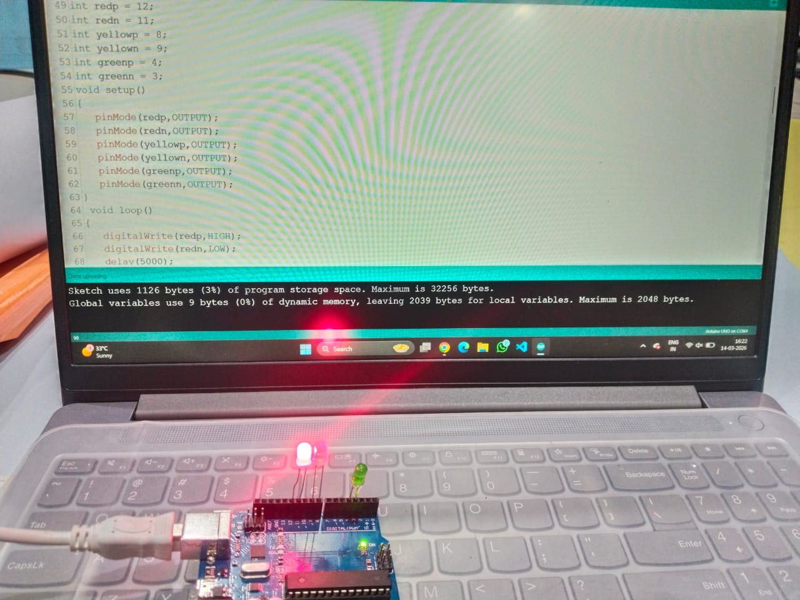
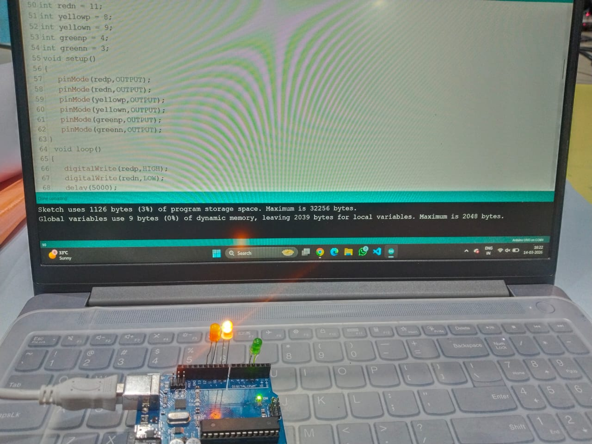
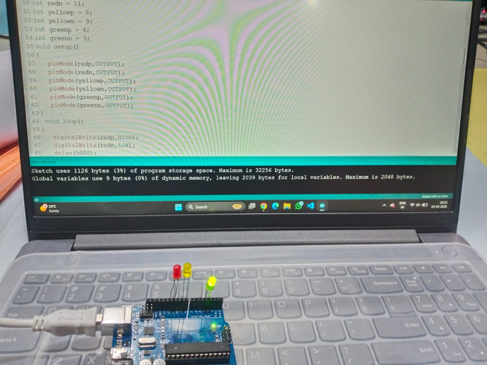

# 🚦 Traffic Light System using Arduino

## 📌 Objective
To simulate a **traffic light control system** using Arduino and LEDs representing **Red, Yellow, and Green signals**.

---

## 🔧 Components Used
- Arduino Uno
- Red LED
- Yellow LED
- Green LED
- Resistors
- Jumper wires
- Breadboard (optional)

---

## ⚙️ Working Principle
Three LEDs represent the traffic signals:

🔴 **Red Light** – Vehicles must stop  
🟡 **Yellow Light** – Prepare to stop or go  
🟢 **Green Light** – Vehicles can move  

The Arduino program turns the LEDs ON and OFF in sequence to simulate the **working of a real traffic signal system**.

Signal timing used in the program:

- Red Light → 5 seconds  
- Yellow Light → 1 second  
- Green Light → 7 seconds  
- Yellow Light → 1 second  

This cycle repeats continuously.

---

## 📷 Output

### 🔴 Red Light

### 🟡 Yellow Light

### 🟢 Green Light

---

## 🎯 Learning Outcome
- Understanding **traffic light sequencing**
- Controlling **multiple LEDs with Arduino**
- Using **timing delays for real-world simulation**
- Learning **basic embedded system logic**

